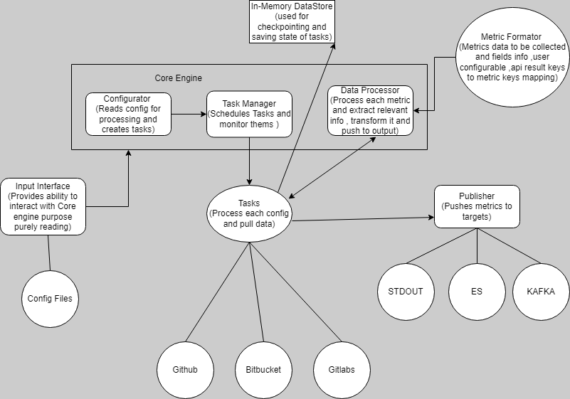

# **Git-Audit Plugin Design**
Git-Audit software will provide ability to monitor git repositories for commits , changes etc and send the data to observability platforms like snappyflow.
Git-Audit software will be provided as a standalone binary for different operating system. It will be supporting all major operating systems including linux(major distributions) , windows etc

## **High level diagram**
This diagram provides high level design for the git-audit software working.

[^1]: Software flow is indicated by arrows in the image above


## **Starting and Stopping the Git-audit**
Git-audit can be started as a standalone binary in two ways 
1. User can take advantage of git-audit inbuilt start and stop functionality

***for starting*** :
```bash
git-audit start 
```
Above command will start a background process for git-audit and save process id in ***git-audit.process*** file in same location as git-audit . If any error in starting the git-audit background process , it will be printed on terminal itself.

***for stopping*** :
```bash
git-audit stop
```
Above command will look for ***git-audit.process*** in current directory and check if any process exist with same id and ***git-audit*** name , if successful it will kill the git-audit process. If no process found , it will print message on terminal.

2. User needs to monitor the process for starting and stopping (helpful in containerised environment)

***for starting*** : user need to keep track of the process id to stop it later
```bash
git-audit --config="/somepath/config.yaml" #note process id
```
***for stopping*** : user needs to kill the process with  process id
```bash
kill -9 1234
```
Note: user can run it in background also using "nohup" as per requirement. 

## **Components of the software**
### ***Input Interface*** 
Input interface is reponsible for taking the input from the user via config file (config.yaml).
1. Input interface reads single config.yaml as input.
2. config.yaml path will be same as the git-audit path or can be added as CLI argument to git-audit binary as
```bash
git-audit start --config="/somepath/config.yaml"
```
or when running binary directly
```bash
git-audit --config="/somepath/config.yaml"
```
or when config.yaml is placed at same location as git-audit binary
```bash
git-audit start
```
3. This component reads the config.yaml and throws error if config.yaml is not found or yaml format is corrupt.
4. After successfully reading the config.yaml , it will validate the config.yaml for mandatory fields.
5. This component will generate internal golang structure which will be transfered to next component i.e Configurator for usage. 

### ***Configurator***
Configurator is responsible for taking the input config from input interface and creating tasks from it.
1. Configurator takes input from input interface and create individual task as golang structures
2. For each task created , it  dry run the credentials provided by the user.
3. If any error occurs , it discards that particular task and log it into error log.
4. If successful , it passes the structure of successfully validated list of tasks to next component ie. Task Manager for scheduling tasks.
5. All tasks will be in same sequence as provided in config.yaml

### ***Task Manager***
Task manager is responsible for running the jobs at there scheduled time. 
1. Task manager takes list of tasks from configurator which needs to be run.
2. It maintains a queue for scheduling the tasks. 
3. It will spawn 2 * No. of core goroutines to run tasks parallely.
Ex: 
If VM has 2 cores , then max task that can run parallely are 2*2 = 4 Tasks
4. Task Manager Algorithm:
    1. Prepare TaskQueue from list of tasks provided by configurator
    2. Maintain a pool 2 * No. of core goroutines 
    3. dequeue a task from TaskQueue 
    4. add it to run in one of the goroutine which is free 
    5. if it is first time task is scheduled , add it immediately 
    6. if it is running second time or more , check previous run time and pool interval to schedule
    7. when task completes , enqueue the task to TaskQueue
    8. Repeat 3 to 4 till a task is available in TaskQueue to schedule
Note: TaskQueue contains each task'ss pooling config , previous run stats and some basic metric like no. of succeefull pools , failure etc 
5. Task manager is responsible for maintaining good concurrency between tasks 

### ***Task***
Each task is a audit job fetches data from the cloud VCS provider (like github, bitbucket etc) APIS's as defined in input and process the response and transform it and push to Publisher.
1. Task reads its previous run state saved in In-Memory DataStore and works accordingly
1. A task takes the config provided and hit respective APIs
2. It provides reponse to data processor for transformation 
3. After tranformation from data processor, it sends the data to the targets as defined in config via Publisher.
4. After publishing the data , task is considered complete
5. Task will save its run state in In-Memory DataStore after completion

### ***Data Processor***
Data processor is responsible for generating the required output data from the API's response as given by each task. It acts as a helper to Task.
1. It uses the metric formator for decoding each API's response to output format. 
2. Once output data is generated , it passes the output back to Task.

### ***Metric formator***
Metric formator is reponsbile for telling the program how to decode each API's response into output. It will consist of json file containing mapping for APIs reponse to ouput format.It acts as a helper to data processor.

### ***Publisher***
Publisher will send the data to target as defined in the input configuration. Target can be anything like elasticsearch , kafka etc
1. It receives the output json and list of target config from Task
2. It spawns multiple goroutine to sent data to all targets as defined in config
3. After successfully sending the output to target , it sends acknowledgement to Task

### ***In-Memory DataStore***
This component is responsible for providing in memory storage to task for saving states between run
1. It checkpoints data regularly (every 5 seconds) to ***checkpoint.json*** in filesystem for storage

## **Taking Credentials from User**
User can provide confidential credentials in two ways:
1. By providing the credentials as system environment variables 
```bash
export AuditJob1=YXNkbGFzaGRsYXMgMjQzMjRzYWwxMjMxZGhsMTIzYWpzZGxh
```
- Credential to be added in base64 encoded format. git-audit will read these and save in golang internal structure for usage
- Environment variable name should be same as audit job name in ***config.yaml***

2. By providing the credentials via config.yaml
```yaml
  repo_config:
    repo_url: https://www.github.com/test/testRepo
    credentials:
      username: testRepo
      email: restRepo@test.com
      access_token: YXNkbGFzaGRsYXMgMjQzMjRzYWwxMjMxZGhsMTIzYWpzZGxh 
```
- Credential to be added in base64 encoded format. git-audit will read these and save in golang internal structure for usage
